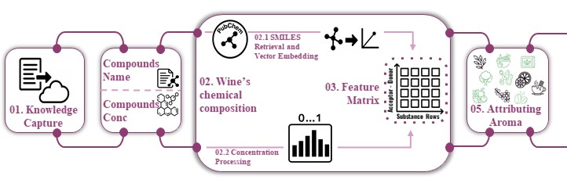
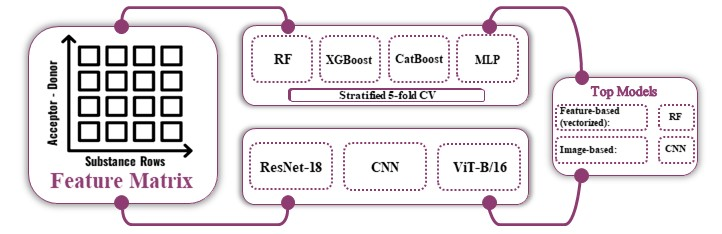

# Wine-Aroma-Prediction
Wine is a complex chemical mixture that includes a variety of organic compounds. The composition of the wine is directly related to the properties of the wine, including the aroma of the wine. Neural networks can be used to predict aroma. In this study, the mol2vec approach is proposed to convert the chemical composition of wine into a digital representation, and the resulting representations are further combined into a matrix for training convolutional neural networks and transformers.

## DataBase
Dataset `WineAroma.csv` was assembled manually from 78 scientific articles. It consists of the name of the wine, the region and country of grape production and growth, the grape variety, the chemical composition and aroma of the wine. Initial data processing is presented in the file `DataAnalysis.ipynb`. Wines were presented from 15 countries of the world, where wines from Spain and Italy predominate, as they are the main world wine regions. The chemical composition is represented by 49 compounds, which are most often found in wines, their concentrations are described as mg/l. The aroma of the wine was divided into 10 categories, such as Herbs and spices, Tobacco/Smoke, Wood, Berries, Citrus, Fruits, Nuts, Coffee, Chocolate/Cacao, Flowers. There is a certain imbalance in the aromas of various wines, most of the wines contain odors such as fruits, herbs and berries, fewer nuts and coffee.

## Digital Representation
The specific chemical composition of each wine in the dataset is described by the concentration of 49 different chemical compounds. Since the number of components can vary from wine to wine, it was decided to represent each wine as a matrix that reflects the composition and concentration of each component. Forty-four key components were selected for flavor prediction because the remaining 5 were extremely rare in the dataset. 
First, the names of wine components were translated into SMILES using PubChemPy. After that each SMILES was represented as a vector using the Mol2vec software package. Then, a general matrix was formed in which each row corresponded to a specific component, arranged according to donor-acceptor properties. For each wine sample, the rows of this matrix were multiplied by the concentration of the corresponding component. If a component was missing, the corresponding row was reset to zero. This process presented in the file `Pre-processing.ipynb`.
<p align="center">
  
</p>

Thus, for each wine a 44x100 matrix was created, which can be considered as a "black and white image", where each "pixel" reflects the presence of a certain structure in the component and its concentration. The research task was reduced to multi-label image classification, for which convolutional neural networks and transformers were employed.

<p align="center">
  
</p>

## Classical ML
At first, classical machine learning models such as Random Forest, Extreme Gradient Boosting, Cat Boosting, and the Multilayer Perceptron were used to predict the flavor of wine. To do this, the resulting matrices were turned into a vector using the flatten operation, after which separate machine learning models were built for each flavor and their accuracy was shown. This process presented in the file `Classical_ML.ipynb`. The result showed that classical machine learning models are highly overtrained and have limited accuracy.

## Transformers
Transformer-based model were explored. A pretrained Vision Transformer was fine-tuned on the grayscale image representations of the wine chemical composition. This process presented in the file `Vision_transformer.ipynb`. The transfer learning strategy enabled the model to exploit representations learned on large-scale image datasets while adapting to the specific domain of wine chemistry. This approach was investigated to assess the potential of attention-based mechanisms in capturing global dependencies and structural patterns within the data.

## Convolutional Neural Networks
In this work, convolutional neural networks (CNNs) were employed to classify wine samples based on their chemical composition. The input data consisted of pre-computed matrices representing the chemical properties of each wine sample, which were transformed into grayscale images. This representation enabled the use of modern computer vision techniques for pattern recognition in the data.
A pretrained ResNet architecture was fine-tuned on the wine dataset. This process presented in the file `ResNet.ipynb`. Leveraging pretrained weights allowed for faster convergence and improved generalization, while the fine-tuning step adapted the model to the specific characteristics of the wine composition images.
A convolutional neural network was designed and trained from scratch. The process of model training is presented in the file `CNN.ipynb`. Several architectural variations were systematically evaluated, and the optimal network configuration was identified based on validation performance. This approach ensured that the model architecture was tailored specifically to the problem at hand, while providing a meaningful comparison to transfer learning methods.

### Performance metrics of neural networks

| Metric        |   CNN | ResNet-18* | ViT-B/16* |
|:--------------|-----:|-----------:|---------:|
| CV Accuracy   | 0.780 | 0.756 | 0.756 |
| CV Loss       | 0.507 | 0.498 | 0.503 |
| Test Accuracy | 0.804 | 0.778 | 0.778 |
| Test Loss     | 0.480 | 0.490 | 0.491 |

\* pretrained & fine-tuned on data.

Together, these experiments highlight the effectiveness of CNN-based approaches and transformer-based models in extracting discriminative features from structured chemical composition data represented as images.
The CNN architecture showed higher accuracy results, but exhibited a higher degree of overfitting compared to ResNet and Vision Transformer.
These findings suggest that representing chemical composition as images is a viable strategy for applying modern deep learning techniques, with CNNs and transformers providing complementary insights into the structure of the data.

## Repository Tree

```text
./
├─ Predict/                 # inference
│  ├─ predict.py
│  ├─ model_best.pt
│  ├─ sample.npy
├─ NeuralNetworks/          # DL notebooks + datasets
│  ├─ CNN.ipynb
│  ├─ ResNet.ipynb
│  ├─ Vision_transformer.ipynb
│  ├─ X_array.npy
│  └─ Y_array.npy
├─ Classical_ML/            # classical ML
├─ DataAnalysis/            # EDA
├─ Pre_processing/          # preprocessing
├─ models/                  # HF backbone metadata
├─ requirements.txt
└─ README.md
```

## Repository Layout and Models 

- **`models/`** holds the pretrained backbones used for transfer learning. These weights are sourced from **Hugging Face** model hubs (e.g., `google/vit-base-patch16-224-in21k` for ViT-B/16 and `microsoft/resnet-18` for ResNet-18).  
- **`Predict/`** contains everything needed for out-of-the-box inference:
  - `Predict/predict.py` — standalone script that loads a trained checkpoint and produces predictions.
  - `Predict/model_best.pt` — the trained model checkpoint (single file).
  - `Predict/sample.npy` — a tiny demo input in NumPy `.npy` format to sanity-check the pipeline.  
    `NeuralNetworks/X_array.npy` contains the full feature tensor. You can (A) create a **single** demo input from it, or (B) export **many** inputs and run batch inference.

    **Create `Predict/sample.npy` from `NeuralNetworks/X_array.npy` (run from repo root):**
    ```bash
    python - <<'PY'
    import os, numpy as np
    X = np.load('NeuralNetworks/X_array.npy', allow_pickle=False)
    x = X[0]  # choose an index here

    # Convert to [H, W] if stored as [1, H, W] or [H, W, 1]
    if x.ndim == 3 and x.shape[0] == 1:
        x = x[0]
    elif x.ndim == 3 and x.shape[-1] == 1:
        x = x[..., 0]

    x = x.astype('float32', copy=False)  # model expects float32
    os.makedirs('Predict', exist_ok=True)
    np.save('Predict/sample.npy', x)
    print('Saved Predict/sample.npy', x.shape, x.dtype)
    PY
    ```

> Note: for large weight files, use Git LFS.

---

## Quickstart (Bash)

```bash
# 1) Clone and enter the repo
git clone https://github.com/heliamphora-ch/wine-aroma-data
cd wine-aroma-data

# 2) Pull large files via Git LFS (model weights)
git lfs install
git lfs pull
# (optional) git lfs checkout

# 3) Verify the weights exist and are not tiny (should be large, e.g., >100MB)
ls -lh Predict/model_best.pt

# 4) Install dependencies (in your venv/conda env)
pip install torch numpy pandas  # optional: pip install pyarrow

# 5) Run single-sample inference (from repo root)
python Predict/predict.py --ckpt Predict/model_best.pt --input_npy Predict/sample.npy --device cpu

# 6) Inspect the result
ls -lh predictions.csv
head -n 5 predictions.csv


